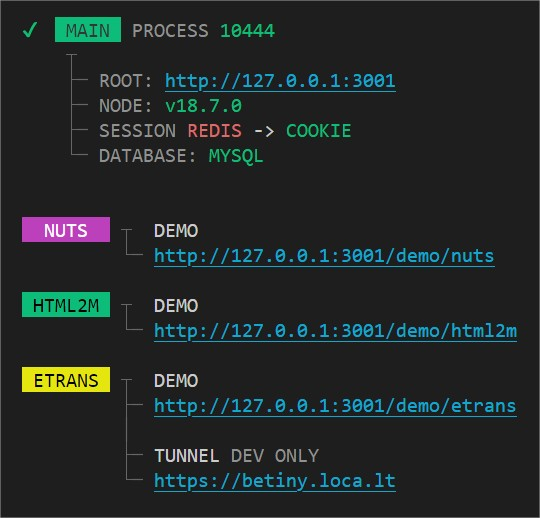

# About
Yeahh webtools implementation using [betiny-core](https://github.com/Braije/betiny-core) as module.

## Command

    yarn start arguments:list

## Note
- /temp for storing local data

## .env

    DEBUG=true
    MODE=dev

    HTTP_PORT=3001
    HTTP_HOST=127.0.0.1

    ROOT_PATH=C:\...\betiny-webtools
    TEMP_PATH=C:\...\betiny-webtools\temp

    MYSQL_HOST=localhost
    MYSQL_PORT=3306
    MYSQL_USER=root
    MYSQL_PASSWORD=
    MYSQL_CONNECTION_LIMIT=100
    MYSQL_DATABASE=betiny

    ETRANS_URL=
    ETRANS_USER=
    ETRANS_PASSWORD=